# 🌤️ Kubernetes Weather & Auth Microservices

A production-ready, highly available microservices application deployed on Kubernetes (Azure VM). This project is logically separated into distinct microservices (UI, Weather, and Authentication) and uses an NGINX Ingress Controller with forced HTTPS.

## Architecture Diagram

```mermaid
graph TD
    User(["🌐 User/Browser"]) -->|HTTPS :443| Ingress["🔀 NGINX Ingress Controller"]
    
    Ingress -->|/| UI["💻 UI Service Pods"]
    Ingress -->|/weather| WeatherSvc["🌤️ Weather Service Pods"]
    Ingress -->|/login| AuthSvc["🔐 Auth Service Pods"]
    
    WeatherSvc -->|External API Call| RapidAPI(("☁️ RapidAPI"))
    
    AuthSvc -->|TCP 3306| DB[("🗄️ MySQL StatefulSet")]
    DB --- PVC["💾 Persistent Volume"]

```




## Key Features

* **Microservices Architecture**: Clean separation between UI, Weather data retrieval, and User Authentication.
* **Database Reliability**: MySQL is deployed as a `StatefulSet` with a `Headless Service` and `PersistentVolumeClaim` (PVC) for data safety.
* **Automated DB Initialization**: A Kubernetes `Job` automatically creates the required databases and users on the first run.
* **Secure Routing**: Centralized routing using `NGINX Ingress Controller` with a self-signed TLS certificate forcing HTTPS redirection.
* **Fully Automated CI/CD**: Seamless build and deployment pipeline using GitHub Actions for zero-downtime rollouts.
* **Cluster Observability**: Real-time monitoring and resource tracking using Prometheus and Grafana.

## Deployment Guide

### 1. Prerequisites & Secrets Setup

For security reasons, sensitive files are ignored in this repository. You must create them before deploying:

* **TLS Certificate (inside `/ui`)**:

```bash
openssl req -x509 -nodes -days 365 -newkey rsa:2048 -keyout ui/tls.key -out ui/tls.crt -subj "/CN=weatherapp.local/O=weatherapp"
kubectl create secret tls weather-tls --key ui/tls.key --cert ui/tls.crt

```

* **Weather API Secret**:
Create your RapidAPI key secret:

```bash
kubectl create secret generic weather --from-literal=apikey='YOUR_RAPIDAPI_KEY'

```

* **MySQL Credentials**:

```bash
kubectl create secret generic mysql-secret --from-literal=root-password='YOUR_ROOT_PW' --from-literal=auth-password='YOUR_AUTH_PW'

```

### 2. Deploy the Infrastructure

Deploy the services in the following order to ensure dependencies are met:

**A. Database & Authentication:**

```bash
kubectl apply -f authentication/mysql/
kubectl apply -f authentication/

```

**B. Weather Service:**

```bash
kubectl apply -f weather/

```

**C. UI & Ingress:**

```bash
kubectl apply -f ui/

```

## Accessing the Application

Add your Kubernetes Node/VM Public IP to your local `/etc/hosts` file:

```text
<PUBLIC_IP> weatherapp.local

```

Navigate to: `https://weatherapp.local`

---

## CI/CD Pipeline (GitHub Actions)

This project uses a GitOps approach with a fully automated Continuous Integration and Continuous Deployment (CI/CD) pipeline.

```mermaid
graph LR
    Dev(["💻 Developer"]) -->|git push| Repo["🐙 GitHub Repo"]
    Repo -->|Triggers| Actions["⚙️ GitHub Actions"]
    Actions -->|1. Build & Push| DockerHub{"🐳 Docker Hub"}
    Actions -->|2. SSH & kubectl set image| K8s["☸️ Azure K8s Cluster"]
    K8s -->|3. Pulls New Image| DockerHub
    K8s -->|4. Rolling Update| Pods["✅ New Pods Running"]
    Pods -.->|5. Rollout Success| Actions

```




### Workflow Stages:

1. **Continuous Integration (CI):** On every push to the `main` branch, the pipeline securely logs into Docker Hub, builds the 3 separate Docker images (`UI`, `Weather`, `Auth`), tags them with the GitHub commit SHA, and pushes them.
2. **Continuous Deployment (CD):** The pipeline securely connects to the Azure VM via SSH, updates the active Kubernetes deployments using `kubectl set image`, and monitors the rollout status to ensure successful zero-downtime updates.


---

## Observability & Monitoring

To ensure high availability and keep track of cluster health, this project implements a robust observability stack installed via **Helm**.

* **Prometheus:** Deployed to scrape and store real-time metrics (CPU, Memory, Network) from all Kubernetes nodes and Pods.
* **Grafana:** Connected to Prometheus to provide powerful, visual dashboards for real-time monitoring.

### Accessing the Grafana Dashboard:

Grafana is exposed via a Kubernetes `NodePort` and can be accessed externally through the Azure VM's public IP on port `32329`.

**Key Monitored Metrics:**

* Cluster-wide Compute Resources (CPU/Memory).
* Namespace Workloads and Pod health.
* Real-time visualization of Kubernetes Self-Healing capabilities (Pod restarts/terminations).


