# 🌤️ Kubernetes Weather & Auth Microservices

A production-ready, highly available microservices application deployed on Kubernetes (Azure VM). This project is logically separated into distinct microservices (UI, Weather, and Authentication) and uses an NGINX Ingress Controller with forced HTTPS.


## 🏗️ Architecture Diagram

```mermaid
graph TD
    User(["🌐 User/Browser"]) -->|HTTPS :443| Ingress["🔀 NGINX Ingress Controller"]
    
    Ingress -->|/| UI["💻 UI Service Pods"]
    Ingress -->|/weather| WeatherSvc["🌤️ Weather Service Pods"]
    Ingress -->|/login| AuthSvc["🔐 Auth Service Pods"]
    
    WeatherSvc -->|External API Call| RapidAPI(("☁️ RapidAPI"))
    
    AuthSvc -->|TCP 3306| DB[("🗄️ MySQL StatefulSet")]
    DB --- PVC["💾 Persistent Volume"]
```




## 📁 Project Structure

The repository is organized by microservices to ensure separation of concerns:

```text
.
├── authentication/      # Go-based Auth app and MySQL Database
│   ├── mysql/           # StatefulSet, Headless Service, and Init Job
│   └── ...
├── ui/                  # Frontend user interface and Ingress routing
│   ├── ingress.yaml
│   └── ...
└── weather/             # Weather API integration service
    └── ...

```

## ✨ Key Features

* **Microservices Architecture**: Clean separation between UI, Weather data retrieval, and User Authentication.
* **Database Reliability**: MySQL is deployed as a `StatefulSet` with a `Headless Service` and `PersistentVolumeClaim` (PVC) for data safety.
* **Automated DB Initialization**: A Kubernetes `Job` automatically creates the required databases and users on the first run.
* **Secure Routing**: Centralized routing using `NGINX Ingress Controller` with a self-signed TLS certificate forcing HTTPS redirection.

## 🚀 Deployment Guide

### 1. Prerequisites & Secrets Setup

For security reasons, sensitive files are ignored in this repository. You must create them before deploying:

* **TLS Certificate (inside `/ui`)**:
```bash
openssl req -x509 -nodes -days 365 -newkey rsa:2048 -keyout ui/tls.key -out ui/tls.crt -subj "/CN=weatherapp.local/O=weatherapp"
kubectl create secret tls weather-tls --key ui/tls.key --cert ui/tls.crt

```


* **Weather API Secret**:
Create your RapidAPI key secret:
```bash
kubectl create secret generic weather --from-literal=apikey='YOUR_RAPIDAPI_KEY'

```


* **MySQL Credentials**:
```bash
kubectl create secret generic mysql-secret --from-literal=root-password='YOUR_ROOT_PW' --from-literal=auth-password='YOUR_AUTH_PW'

```


### 2. Deploy the Infrastructure

Deploy the services in the following order to ensure dependencies are met:

**A. Database & Authentication:**

```bash
kubectl apply -f authentication/mysql/
kubectl apply -f authentication/

```

**B. Weather Service:**

```bash
kubectl apply -f weather/

```

**C. UI & Ingress:**

```bash
kubectl apply -f ui/

```

## 🌐 Accessing the Application

Add your Kubernetes Node/VM Public IP to your local `/etc/hosts` file:

```text
<PUBLIC_IP> weatherapp.local

```

Navigate to: `https://weatherapp.local`

